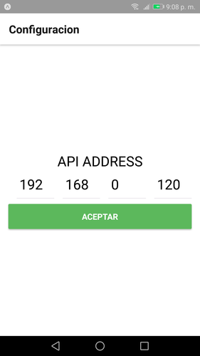

# Proyecto Nezter examen

## Instrucciones

El pryecto consta de 2 carpetas backend y frontend. En backend esta desarrollado Express js y mongodb. El frontend se desarrollado en React Native (expo).

### Instalacion

Para iniciar el **_backend_** (se usa docker).

```
$ docker-compose up
```

Para el proyecto **_frontend_** en caso de ser necesario instalamos **_expo_** de forma global.

```
$ npm install -g exp
```

Antes de iniciar el proyecto **_frontend_** instalamos las dependencias del pryecto.

```
$ cd frontend
$ npm install
```
Como estamos usado ***expo*** como herramienta de desarrollo, es necesario contar con una cuenta, una ves que nos damos de alta desde la terminal hacemos login e introducimos usurio y password.

```
$ exp login
```
si solo deseamos ver la app, hemos puesto a disposicion el archivo ***APK*** para facilitar todo, el cual lo podemos descargar de la de [**_aqui_**](https://exp-shell-app-assets.s3-us-west-1.amazonaws.com/android%2F%40diademuertos%2Ffrontend-8905050d-76cd-11e8-acbd-0a580a78060c-signed.apk).

Para iniciar el proyecto **_frontend_**:

```
$ cd frontend
$ exp start --host lan
```
Esto inicializara el servicio necesario para la generacion de la aplicacion movil que podra ser vista desde nuestro dispositivo movil.

Una vez inicado el servicio **_expo_**, desde nuestro dispositivo podemos ver la app, mediante la aplicacion [**_expo_**](https://play.google.com/store/apps/details?id=host.exp.exponent&hl=en) que debemos bajar de la tienda de google.

Si por alguna razon no es posible iniciar el proyecto **_frontend_** podemos descargar la app desde el siguiente repositorio o el archivo ***APK***

- [Frontend](https://expo.io/@diademuertos/frontend) - repositorio expo.
- [APK](https://exp-shell-app-assets.s3-us-west-1.amazonaws.com/android%2F%40diademuertos%2Ffrontend-8905050d-76cd-11e8-acbd-0a580a78060c-signed.apk) - repositorio expo.

Solo seria necesario escanear el cogido **_QR_** con la app [**_expo_**](https://play.google.com/store/apps/details?id=host.exp.exponent&hl=en) que como ya se comento la debemos bajar de la tienda de google desde nuestro dispositivo movil(solo para el caso ***frontend*** repositorio). Para el ***APK*** solo descargamos el archivo e instalamos.

Ya que la app a iniciado solo resta proporcionar la direccion ip del **_backend_**.



---

## Nota

Para este desarrollo se uso node 8.9.1
y exp 55.0.4. Los dipositivos android deben ser igual o moyores al API 23 (android 6).
